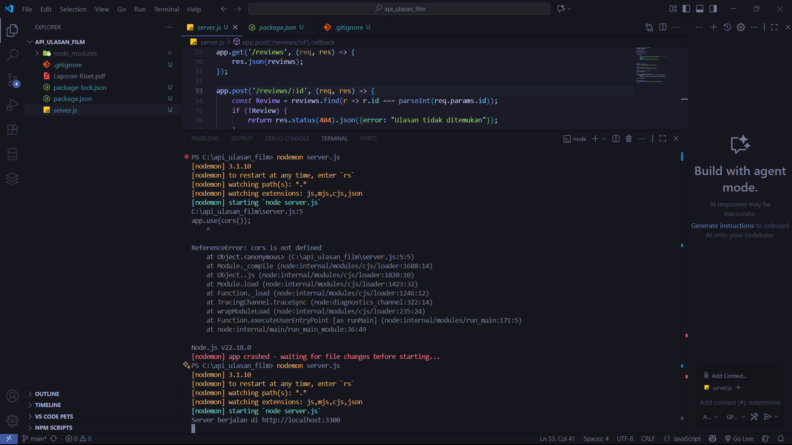
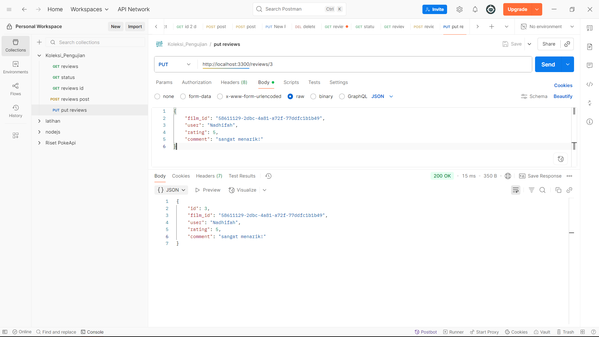

# <h1 align="center">PROYEK API ULASAN FILM - KELOMPOK 02</h1>
### <h1 align="center">INTEGRASI API: ANALISIS LAYANAN EKSTERNAL DAN PEMBANGUNAN LAYANAN INTERNAL</h1>

## ANGGOTA KELOMPOK
- Dian Restu Khoirunnisa (362458302094)
- Vina Faizatus Sofita (362458302095)
- Danish Naisyila Azka (362458302098)
- Nadhifah Afiyah Qurota'ain (362458302100)

## <h1 align="center">DESKRIPSI PROYEK</h1>
API ini adalah layanan internal untuk mengelola ulasan film dari Studio Ghibli, dengan data film yang direferensikan dari ghibli API publik. Proyek ini bertujuan untuk menyediakan sebuah sistem sederhana di mana pengguna dapat menambahkan, melihat, memperbarui, dan menghapus ulasan film. Melalui API ini, data film tidak dimasukkan secara manual, melainkan diambil dari API Studio Ghibli yang sudah ada, sehingga lebih praktis.

## <h1 align="center">CARA MENJALANKAN PROYEK</h1>
1. Clone repository ini: 'git clone'
Dengan perintah ini, seluruh isi repository dari github disalin ke laptop sehingga bisa dikerjakan secara secara offline. Setelah clone selesai, anggota kelompok sudah memiliki salinan project yang sama dengan yang ada di GitHub.

2. Masuk ke direktori: 'cd NAMA_REPO'
Folder ini otomatis terhubung dengan repository di GitHub, sehingga setiap perubahan yang dilakukan bisa langsung dipush untuk diperbarui di repository online.

3. Install dependensi: 'npm install'
Proses instalasi menggunakan 'npm install express cors'. Express digunakan untuk membuat server API, sedangkan Cors dipakai agar server bisa diakses dari luar. instalasi ini wajib dilakukan supaya server bisa berjalan dengan baik.

4. Jalankan server: 'node server.js'
'nodemon server.js' digunakan karena akan otomatis restart setiap kali ada perubahan kode. Dengan begitu, proses uji coba dan perbaikan aplikasi jadi lebih cepat dan tidak perlu menjalankan ulang server secara manual.

Sebelum menjalankan 'nodemon server.js' pastikan nodemon sudah diinstal dengan perintah

Server akan berjalan di 'http://localhost:3300'.

## <h1 align="center">DAFTAR ENDPOINT</h1>
- 'GET/status': Cek status API.
Berfungsi untuk mengecek apakah server API sedang aktif. Dengan mengakses /status, server akan merenspons pesan sederhana seperti "API is running" atau kode 200OK. Fitur ini penting saat pengembengan, karena jika gagal berarti server tidak berjalan dan perintah lain juga tidak bisa digunakan.

- 'GET/reviews': Mengambil semua ulasan.
Digunakan untuk menampilkan semua data ulasan yang ada di database. Hasilnya berupa daftar lengkap dalam format JSON berisi ID, user, rating, comment dan waktu dibuat. Fitur ini berguna untuk menampilkan kumpulan ulasan di aplikasi atau website.

- 'GET/reviews/:id': Mengambil ulasan spesifik.
Perintah ini digunakan untuk mengambil satu ulasan tertentu berdasarkan ID. Simbol ':id' mewakili angka unik, misalnya '/reviews/1' berarti menampilkan ulasan dengan ID 1. Jika data ada, server akan mengembalikan detail ulasan tersebut, tapi jika ditemukan maka akan muncul error 404 NOT Found. Fitur ini berguna saat pengguna ingin melihat detail sebuah ulasan secara spesifik.

- 'POST/reviews': Membuat ulasan baru.
Berfungsi untuk menambah ulasan baru. Misalnya seorang pengguna menulis komentar dan memberi rating, data itu dikirim ke server dengan metode POST. Server lalu memeriksa data, menyimpannya ke database, dan memberikan ID unik secaraa otomatis. Dengan cara ini, ulasan baru bisa masuk dan tersimpan di sistem.

- 'PUT/reviews/:id': Memperbarui ulasan.
Perintah PUT digunakan untuk memperbarui ulasan yang sudah ada. Misalnya sebelumnya memberi rating 3 lalu ingin mengubah menjadi 5, maka data baru dikirim dengan ID ulasan yang sama. Server akan mencari ulasan tersebut dan mengganti isinya sesuai data baru. Biasanya, PUT mengganti seluruh data lama, jadi semua field penting harus dikirim kembali.

- 'DELETE/reviews/:id': Menghapus ulasan.
Perintah DELETE digunakan untuk menghapus ulasan secara permanen. Misalnya 'DELETE/reviews/1' akan menghapus ulasan dengan ID 1 dari database dan tidak bisa dikembalikan lagi. Biasanya dipakai saat pengguna ingin menghapus konten yang melanggar aturan. Karea risikonya besar, sistem sering menambahkan verifikasi seperti login atau konfirmasi sebelum perintah ini dijalankan.

